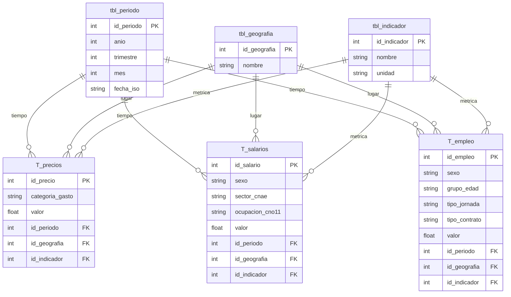

# 📈 Análisis de la Evolución del Poder Adquisitivo en España

## 👥 Autoría y Contribuciones

Este proyecto fue desarrollado en equipo como parte del **Curso de Especialización en IA y Big Data** (IES Punta del Verde, 2025-2026).

> ⚠️ **Nota sobre el repositorio:** Este repositorio es un *fork* del proyecto original adaptado para mi portfolio personal.
> **[Repositorio original](https://github.com/belenmrqz/Fork_Paula_Belen)** 

### 🛠️ Mi contribución principal al proyecto:
* **Ingeniería de Datos:** Diseño de la arquitectura de la base de datos (modelo en estrella con SQLite) y desarrollo del pipeline ETL conectado a la API del INE.
* **Procesamiento de Datos:** Implementación del procesamiento de datos en memoria de alto rendimiento utilizando Polars.
* **Machine Learning:** Entrenamiento del modelo *Gradient Boosting* para predecir precios de vivienda y diseño de la estrategia para la prevención de *Data Leakage*.
* **Despliegue (MLOps):** Desarrollo y despliegue del dashboard interactivo y el simulador predictivo en Streamlit utilizando Plotly y Tableau.

---

## 🎯 Objetivo del Proyecto

El objetivo principal de este proyecto es analizar la evolución del poder adquisitivo de la clase trabajadora en España mediante un sistema automatizado de **Ingeniería y Análisis de Datos**.

El proyecto implementa un pipeline completo **End-to-End** que abarca 5 grandes fases:
1. **Fase 1 (Data Engineering):** Un proceso ETL que recopila datos macroeconómicos de la API del INE y los modela en una base de datos relacional (SQLite).
2. **Fase 2 (Data Preparation):** Procesamiento de datos en memoria de alto rendimiento y exportación a la Capa Oro (CSV/Parquet) utilizando **Polars**.
3. **Fase 3 (Data Analytics & Business Intelligence):** Generación de visualizaciones interactivas con **Plotly** y desarrollo de Cuadros de Mando y *Storytelling* narrativo con **Tableau**.
4. **Fase 4 (Machine Learning):** Desarrollo de modelos para la segmentación socioeconómica territorial (Clustering K-Means) y la predicción del precio de la vivienda (Gradient Boosting).
5. **Fase 5 (Despliegue Web):** Integración de todos los análisis, bases de datos y modelos predictivos en un Dashboard interactivo desarrollado con **Streamlit**.

El sistema permite desglosar la información por **Comunidades Autónomas**, sectores de actividad y grupos socioeconómicos, demostrando matemáticamente relaciones entre el paro, los salarios y la inflación.

---

## 📊 Fuentes de Datos (INE - API JSON-stat)

El proyecto se alimenta de fuentes oficiales del **Instituto Nacional de Estadística (INE)** mediante peticiones automatizadas a su API. A continuación se enlazan las tablas originales utilizadas:

### 1. Gasto y Coste de Vida
* **[IPC - Índice de Precios de Consumo (Tabla 50913)](https://www.ine.es/jaxiT3/Tabla.htm?t=50913):** Se extrae el índice general, variación anual y categorías clave (Alimentos, Transporte, Energía) para medir la inflación real.
* **[IPV - Índice de Precios de Vivienda (Tabla 25171)](https://www.ine.es/jaxiT3/Tabla.htm?t=25171):** Evolución del precio de compra de vivienda (Índice general y variación anual).

### 2. Ingresos y Salarios
* **[ETCL - Encuesta Trimestral de Coste Laboral (Tabla 6061)](https://www.ine.es/jaxiT3/Tabla.htm?t=6061):** Datos trimestrales sobre el *Coste Salarial* bruto (filtrando costes de seguridad social).
* **EAES - Encuesta Anual de Estructura Salarial:** Datos estructurales para medir la desigualdad.
    * *[Ganancia por trabajador (Tabla 28191)](https://www.ine.es/jaxiT3/Tabla.htm?t=28191):* Media, Mediana, Deciles 10 y Cuartil inferior.
    * *[Ganancia por ocupación (Tabla 28186)](https://www.ine.es/jaxiT3/Tabla.htm?t=28186):* Salarios desglosados por tipo de trabajo.

### 3. Empleo
* **[EPA - Tasa de Paro (Tabla 65334)](https://www.ine.es/jaxiT3/Tabla.htm?t=65334):** Tasa de paro (desglosada por sexo y edad).
* **[Asalariados por tipo de contrato (Tabla 65132)](https://www.ine.es/jaxiT3/Tabla.htm?t=65132):** Datos de asalariados totales vs. temporales (filtrados por jornada total) para calcular la tasa de temporalidad real.

---

## 🗄️ Arquitectura de Datos (Star Schema)

Se ha diseñado una base de datos **SQLite3** siguiendo un **Modelo en Estrella (Star Schema)**. Esta arquitectura separa las *dimensiones* (tablas de búsqueda) de las *tablas de hechos* (datos numéricos), optimizando el análisis posterior.

### Estructura Relacional
La base de datos se organiza en torno a tres tablas centrales de hechos que comparten las mismas dimensiones para facilitar el cruce de datos:

**Tablas de Dimensiones (Lookups):**
* **`tbl_periodo`**: Tabla maestra de tiempo. Normaliza frecuencias mensuales (IPC), trimestrales (EPA) y anuales (EES).
* **`tbl_geografia`**: Comunidades Autónomas y Total Nacional.
* **`tbl_indicador`**: Catálogo unificado de variables (ej: "IPC_General", "Salario_Mediana", "Tasa_Paro").

**Tablas de Hechos (Facts):**
| Tabla | Descripción | Desglose / Segmentación |
| :--- | :--- | :--- |
| **`T_precios`** | Unifica IPC e IPV. | `categoria_gasto` (Alimentos, Vivienda...) |
| **`T_salarios`** | Unifica ETCL y EES. | `sector_cnae`, `ocupacion_cno11`, `sexo` |
| **`T_empleo`** | Unifica Paro y Temporalidad. | `grupo_edad`, `tipo_contrato`, `tipo_jornada` |



---

## ⚙️ Arquitectura y Flujo del Pipeline End-to-End

El proyecto sigue una **arquitectura desacoplada**: un Backend (Pipeline ETL y Machine Learning) que procesa y digiere los datos de forma pesada, y un Frontend (Streamlit) ligero que consume los resultados estáticos (Capa Oro) para maximizar el rendimiento web.

### 1. Estructura de Ficheros (Vista General)
El código se organiza en la raíz mapeando directamente las 5 fases del proyecto:

```text
📁 Proyecto
├── 📄 main.py               # Orquestador Central CLI: Ejecuta el pipeline de datos (Backend).
├── 📄 app.py                # Orquestador Web: Lanza el Dashboard interactivo (Frontend).
├── 📁 src                   # FASE 1: Ingesta, transformación y carga en SQLite.
├── 📁 analysis              # FASE 2 y 3: Preparación con Polars y gráficas con Plotly.
├── 📁 models_training       # FASE 4: Entrenamiento de Machine Learning (K-Means y Gradient Boosting).
├── 📁 data_output           # CAPA ORO: Base de datos final, CSVs, Parquets, Modelos y HTMLs.
├── 📁 views                 # FASE 5: Vistas individuales de la interfaz web (Streamlit).
├── 📁 utils                 # Módulos transversales compartidos (Caché, Helpers, CSS).
├── 📁 config                # Diccionarios, rutas, constantes y configuraciones globales.
├── 📁 assets                # Recursos estáticos (Imágenes para el README, estilos CSS).
├── 📄 Actividad_3.2...twbx  # Cuadro de mando interactivo empaquetado (Tableau).
├── 📄 proyecto_datos.db     # Base de datos local resultante (SQLite).
├── 📄 pyproject.toml        # Configuración moderna del proyecto y gestor de paquetes.
├── 📄 requirements.txt      # Dependencias bloqueadas con Hashes de seguridad (uv).
└── 📄 README.md             # Documentación principal y conclusiones del proyecto.
```


### 2. Detalle del Proceso de Datos

### Fase 1: Ingeniería de datos e Ingesta

#### 1. Extracción (`src/inedata.py`)
* Conexión HTTP robusta con la API **JSON-stat** del INE.
* Gestión de errores de conexión y tiempos de espera (timeout).
* Descarga de series temporales completas en formato crudo (raw data).

#### 2. Transformación (`src/procesar.py`)
Es la etapa más compleja, donde se aplica la lógica de negocio para asegurar la calidad del dato:
* **Parsing de Metadatos:** Se descomponen las cadenas de texto del INE (ej: *"Total Nacional. Industria. Coste..."*) para extraer dimensiones limpias (Geografía, Sector, Sexo).
* **Filtrado de Salarios:** Se discrimina entre *"Coste Laboral"* y *"Coste Salarial"*, conservando únicamente este último (salario bruto) para reflejar la remuneración real del trabajador.
* **Lógica de Empleo:** Se filtran los datos de jornada parcial para calcular la **Temporalidad** basándose exclusivamente en contratos de jornada completa (comparando *Total Asalariados* vs *Temporales*).
* **Normalización del IPC:** Se agrupan y renombran las categorías de gasto (Alimentos, Vivienda, Transporte) para facilitar consultas SQL posteriores.

#### 3. Carga (`src/almacenar.py`)
* **Enrutamiento Inteligente:** El sistema detecta automáticamente a qué tabla de hechos (`T_precios`, `T_salarios`, `T_empleo`) deben ir los datos según su código de origen.
* **Gestión de Integridad:** Uso de sentencias `INSERT OR IGNORE` combinadas con claves únicas compuestas (`UNIQUE`) en la base de datos. Esto permite re-ejecutar el script tantas veces como sea necesario sin generar registros duplicados.

---

### Fase 2: Data Preparation (Polars)

Para optimizar el rendimiento y demostrar el dominio técnico de la herramienta, se realizaron únicamente **3 consultas maestras** a la base de datos SQLite (extrayendo los bloques en bruto de Salarios, Precios y Empleo). A partir de ahí, se delegó toda la carga analítica a **Polars** (`analysis/transform.py`), realizando en memoria todos los **filtrados, pivotados (reshaping) y agregaciones** necesarios.

Durante esta fase de transformación se resolvieron los siguientes retos:

* **Normalización a Base 100:** Para poder comparar magnitudes económicas con unidades distintas (ej. euros de salario vs. índice de precios de vivienda), se transformaron las series temporales a **Base 100** tomando como referencia el año correspondiente, permitiendo analizar de forma relativa la "carrera" de su crecimiento.
* **Ilusión Monetaria y Correlaciones:** Se deflactaron los salarios cruzándolos con el IPC General y se calcularon matrices de correlación de Pearson entre la tasa de paro y los salarios por CCAA (Curva de Phillips).
* **Gestión de Secretos Estadísticos:** Se detectaron y limpiaron salarios con valores negativos ocultos por el INE en la tabla de ocupaciones, evitando distorsiones graves en el cálculo de la brecha de género.
* **Exportació:n** Los resultados finales (Capa Oro) se exportaron a `.csv` y, como mejora adicional, a **`.parquet`**. El guardado columnar de Polars en formato Parquet reduce drásticamente el peso del archivo y acelera exponencialmente futuras lecturas.

### Fase 3: Análisis Visual y Conclusiones (Plotly)

A partir de la Capa Oro, el script `analysis/visualize.py` genera visualizaciones interactivas (disponibles en `/data_output/graphics/` o desde `/data_output/index.html`). 

A continuación, se exponen las capturas de los gráficos principales y las conclusiones extraídas de los datos:

#### 1. Evolución Salarial por CCAA (2008-2023)


* **Crecimiento General**: Los salarios nominales han subido en todas las regiones desde 2008, acelerándose tras la pandemia (2020).
* **Brecha Territorial:** Se mantiene una jerarquía clara: **País Vasco y Madrid** lideran (32k€+), mientras que **Extremadura y Canarias** cierran la lista (<24k€). La distancia entre las regiones más ricas y pobres se ha ensanchado.
* **Hito Crítico**: Se observa un estancamiento salarial prolongado entre **2010 y 2015** debido a la crisis financiera.

#### 2. La Carrera: Salarios vs Precio de la Vivienda

* **Crecimiento Desigual**: Desde 2015, el precio de la vivienda ha subido un **50%**, mientras que los salarios solo han crecido un **20%**.
* **Brecha de Accesibilidad**: La vivienda crece a más del **doble de velocidad** que los sueldos, lo que supone una barrera cada vez mayor para el ahorro y la compra de inmuebles.
* **Tendencia**: Tras la caída de precios entre 2008 y 2014, la recuperación del mercado inmobiliario ha desbordado por completo la capacidad adquisitiva de los trabajadores.

#### 3. Brecha Salarial de Género por Ocupación (2023)

* **Desigualdad Generalizada**: Todas las ocupaciones presentan una brecha salarial positiva a favor de los hombres, oscilando entre el **7,5% y el 25,4%**.
* **Sectores Críticos**: La mayor brecha se concentra en trabajos manuales e industriales (**25%**), como operarios y trabajadores cualificados de la manufactura.
* **Menor Disparidad**: Los sectores de enseñanza, salud y perfiles técnicos cualificados presentan la brecha más baja (**7,5% - 14%**), aunque sigue siendo significativa.

#### 4. Curva Salarial Regional (Paro vs Salarios)

* **Tendencia Inversa**: El gráfico muestra una clara pendiente negativa; visualmente se confirma que las regiones con menores tasas de desempleo (como Madrid o País Vasco) logran sostener salarios mucho más altos.
* **Dualidad Regional**: Existe una brecha evidente entre el bloque de bajo paro/salario alto frente a las regiones con desempleo estructural, donde los salarios medios se ven presionados a la baja, estancándose cerca de los 20k-22k€.

Para verificar matemáticamente esta correlación negativa se calculó la Correlación de Pearson:


* **Confirmación Matemática**: Todos los coeficientes son negativos (entre **-0,41 y -0,64**), lo que demuestra que la relación inversa no es casualidad, sino una constante en toda España.
* **Sensibilidad Regional**: En regiones como **Castilla y León (-0,64)** y **Canarias (-0,61)**, el mercado laboral es más sensible: el paro tiene un impacto mucho más directo y fuerte en el frenado de los salarios que en otras comunidades.

#### 5. Ilusión monetaria: Salario nominal vs Salario Real (Base IPC 2021 = 100)

* **Divergencia Evidente:** Mientras que el **salario nominal** (euros brutos en nómina) muestra un crecimiento fuertemente acelerado en los últimos años, el **salario real** (poder adquisitivo) presenta una tendencia general a la baja desde su pico máximo cerca de 2009.

* **El Punto de Inflexión (2021):** El año 2021 marca el cruce exacto de ambas líneas (al ser el año base del IPC). A partir de este punto, la inflación genera una enorme brecha: los sueldos sobre el papel suben drásticamente, pero la capacidad real de compra cae en picado.

* **Pérdida de Poder Adquisitivo:** A pesar de que en 2025 un trabajador cobra nominalmente unos 550€ más que al inicio de la serie (pasando de ~1.810€ a >2.350€), su poder adquisitivo real es inferior al que tenía hace más de 15 años, cayendo por debajo de los 2.000€.

#### 6. Calidad del Empleo en España: Contratos Indefinidos vs Temporales 

* **Pico de Temporalidad Histórica:** En los primeros años de la serie (hasta 2006 aproximadamente), el empleo temporal presentaba su mayor volumen, con los contratos indefinidos representando apenas el **66-67%** del total de asalariados.

* **Estancamiento en la Década (2010-2020):** Durante estos años, la proporción de contratos indefinidos se mantuvo relativamente estable pero estancada, oscilando entre el **73% y el 76%.** Esto reflejaba una tasa de temporalidad estructural que no lograba bajar del 24-25%.

* **Cambio de Tendencia Drástico:** A partir de 2021-2022 se observa una escalada abrupta en la proporción de contratos indefinidos. La gráfica muestra cómo esta tasa rompe la barrera del 80% y continúa subiendo hasta acercarse al **85%** en 2025, lo que comprime la cuota de contratos temporales a mínimos de la serie (en torno al 15%).

#### 7. Desigualdad Salarial en España: Evolución por Tramos de Ingresos

* **Brecha entre Media y Mediana:** El salario medio (línea azul) se sitúa sistemáticamente por encima del salario mediano (línea verde) durante toda la serie histórica. Esto indica una distribución asimétrica donde los sueldos más altos tiran del promedio general hacia arriba: en 2023, la media se acerca a los 28.000€, mientras que la mediana (el salario más frecuente) se queda en torno a los 23.000€.

* **Impacto en las Rentas Bajas:** El percentil 10 (la línea roja, que representa al 10% que menos cobra) sufrió una ligera caída durante los años posteriores a 2008, tocando fondo alrededor de 2014 por debajo de los 8.000€ anuales. Sin embargo, en los últimos años muestra una fuerte recuperación, superando los 11.000€ en 2023.

* **Crecimiento Generalizado Reciente:** Tras un periodo de estancamiento general entre 2008 y 2014, a partir de 2016 todos los tramos salariales inician una clara tendencia alcista. Esta subida nominal se acelera especialmente en el último tramo de la gráfica (2020-2023) para todos los niveles de ingresos.

#### 8. Evolución de la Tasa de Paro por CCAA (Gráfico Facetado)

* **Patrón Común de Crisis y Recuperación:** Todas las comunidades autónomas muestran una curva evolutiva muy similar, marcada por un fuerte aumento del desempleo que alcanza su punto máximo alrededor de los años 2013 y 2014, seguido de un descenso progresivo y generalizado en la última década.

* **Las Tasas Históricas Más Altas:** Regiones como Andalucía, Canarias y Extremadura destacan por haber sufrido los impactos más severos durante el pico de la crisis, superando claramente la barrera del 30% de paro.

* **Comunidades con Menor Impacto:** En el extremo opuesto, el País Vasco, Navarra, Aragón y La Rioja presentan las curvas más planas y contenidas. En estas zonas, los picos máximos apenas rozaron el 20% y actualmente cierran la serie temporal situándose en torno al 10% o incluso por debajo.

___
## Métricas y Visualización Exploratoria con Tableau

Una vez finalizada la fase de procesamiento y estructuración de datos con Polar, entramos en la etapa de **Explotación de datos**. 
Utilizaremos la herramienta de Business Intelligente (BI) **Tableau** para generar informes gráficos sobre los datos procesados anteriormente. 

### Paso 1: Generar una conexión híbrida

#### Carga de archivos:
Importaremos al programa de Tableau los CSV que procesamos anteriormente con Polars

#### Conexión a la BBDD (Simulación de arquitectura):
Dado que la versión de Tableau Public presenta limitaciones nativas para conectarse directamente a gestores de bases de datos locales, hemos optado por "simular" esta conexión. Para ello, hemos utilizado los CSV finales exportados desde la extracción en Python con Polars, realizando los *joins* y cruces del modelo de datos de forma relacional directamente en el panel "Fuente de datos" de Tableau.


#### Consideraciones Técnicas y Troubleshooting:
Durante la ingesta de datos en Tableau, nos enfrentamos a un par de retos de formato muy comunes al integrar Python con herramientas de BI, los cuales resolvimos así:

* **El parseo de decimales**: Por defecto, Tableau en español espera que los números decimales estén separados por comas (`,`). Sin embargo, nuestros datos procesados en Python siguen el estándar internacional usando el punto (`.`). Para evitar que Tableau leyera los precios o porcentajes como texto (o ignorara los decimales), tuvimos que especificar la configuración regional en inglés al importar los datos para que reconociera correctamente el formato numérico.

* **Delimitadores del CSV**: Al insertar algunos de los datasets, Tableau no detectó automáticamente las comas como separadores de columnas, amontonando toda la información en una sola fila. Lo solucionamos accediendo a las propiedades del archivo de texto dentro de Tableau y forzando manualmente el uso de la coma (`,`) como delimitador de campo.

### 📊 Visualizaciones individuales
Con el objetivo de experimentar la creación de gráficas y aplicar parte de los muchos filtros y funciones que tiene la herramienta Tableau hemos replicado los 9 gráficos que creamos con Plotly. 

Sin embargo, hemos experimentado con 3 gráficos nuevos:

1. **Tasa de paro de Hombres vs Mujeres por edad**


Esta gráfica de barras agrupadas desglosa el problema del desempleo en España con una lupa doble: nos muestra el porcentaje de paro separado no solo por hombres y mujeres, sino también por tramos de edad.

Es una visualización clave para desmontar el "paro general" y ver la realidad de los más vulnerables. Por ejemplo, a simple vista destaca cómo el desempleo juvenil (de 16 a 19 años) se dispara radicalmente frente al resto, castigando además con mucha más dureza a las mujeres jóvenes.

**🎛️ ¿Cómo interactuar con ella?**
La gráfica cuenta con dos selectores a la derecha para que puedas explorar los datos a tu medida:

- 🎚️ El viaje en el tiempo (Año): Puedes mover el deslizador del año o escribir uno en concreto (ej. 2025) para comprobar si la brecha de género está mejorando o empeorando con el paso del tiempo.

- 📍 El filtro local (Comunidad Autónoma): Desmarca la casilla "(Todo)" y elige solo tu Comunidad Autónoma para descubrir si en tu región hay más paro juvenil o femenino que en la media nacional.


2. **Impacto de la Inflación por Categoría de Gasto**


Esta gráfica es el "termómetro" real de nuestros bolsillos. Nos muestra cómo han evolucionado los precios de las cosas que pagamos en el día a día (comida, luz, sanidad, ocio, etc.) desde el año 2002 hasta la actualidad.

Para que sea súper fácil de leer, hemos aplicado un código de colores térmico: el color verde indica los años en los que los precios eran bajos y manejables, mientras que el rojo intenso funciona como una señal de alarma que marca cuándo los precios se han disparado. A simple vista, es imposible no notar la "ola roja" que asfixia categorías de primera necesidad (como Alimentos o Vivienda) en los últimos años, explicando visualmente por qué a las familias les cuesta cada vez más llegar a fin de mes, aunque sus sueldos hayan subido.

**🎛️ ¿Cómo interactuar con ella?**

- 🎚️ Monta tu propia cesta de la compra (Selector de categorías): En el menú de la derecha puedes marcar o desmarcar casillas para analizar solo los gastos que te interesen. ¿Quieres comparar si ha subido más la comida o la factura del teléfono (Comunicaciones)? Selecciona solo esas dos y descúbrelo.

- 🔍 El dato exacto a un clic (Zoom-in): Si ves un bloque muy rojo (por ejemplo, los Alimentos en 2024) y quieres saber el dato preciso, solo tienes que pasar el ratón por encima de esa barra para que se despliegue una tarjeta con los valores exactos.


3. **Salario Medio Anual por Comunidad Autónoma (Mapa de Calor Regional)**


Esta gráfica nos muestra, de un vistazo, cómo se reparte el dinero por toda España. Cada Comunidad Autónoma se tiñe de un color azul diferente (de claro a oscuro) para representar su salario medio anual.

Es una visualización crucial para entender las desigualdades territoriales. La "media nacional" esconde realidades muy dispares, y este mapa las saca a la luz de forma instantánea. Los colores más oscuros marcan las zonas donde se cobra más (como Madrid, País Vasco o Navarra), mientras que los más claros nos señalan las regiones con salarios más modestos. Esto nos permite analizar cómo el lugar de residencia impacta directamente en la capacidad de las familias para afrontar el coste de la vida.

**🎛️ ¿Cómo interactuar con ella?**

- 🔍 El dato exacto a un clic (Zoom-in): Si quieres saber el salario medio preciso de tu región, solo tienes que pasar el ratón por encima de esa Comunidad Autónoma para que se despliegue una tarjeta (Tooltip) con el valor exacto y el año.

### 🗺️ Dashboard (Cuadro de Mando)

El objetivo de este dashboard interactivo es ofrecer una visión integral y territorial de la realidad económica de los ciudadanos. En lugar de analizar métricas aisladas, este panel conecta el mercado laboral (empleo), los ingresos (salarios) y el coste de la vida (inflación) para entender el verdadero poder adquisitivo y la vulnerabilidad económica de la población.


#### Gráficos seleccionados:
1. **El Mapa de España (El filtro principal del panel):**
España es muy diferente según donde vivas. Si haces clic en tu Comunidad Autónoma en el mapa, las otras tres gráficas se actualizan al instante para mostrarte en exclusiva la realidad de tu zona.

2. **El Paro por Edad y Sexo:**
Nos enseña visualmente quiénes son los más vulnerables. Permite ver de un vistazo si el problema lo tienen más los jóvenes para encontrar su primer empleo, o si existe una brecha clara entre hombres y mujeres.

3. **Evolución del Salario Medio:**
Representa "el dinero que entra en casa". Nos sirve para ver si los salarios están creciendo o si, por el contrario, llevan años estancados.

4. **La Inflación por Categorías:**
Representa "el dinero que sale de casa". Es la pareja perfecta para la gráfica del salario: de nada sirve alegrarnos porque el sueldo suba un poco, si al lado vemos que el precio de los alimentos o la luz ha subido el doble. Esto explica por qué a la gente le cuesta más llegar a fin de mes.

### 📖 Storytelling (Historias de Tableau): La Ilusión Monetaria y la Brecha Social

Para culminar la fase de análisis visual y dar respuesta a la pregunta principal del proyecto, hemos utilizado la función **"Historias"** de Tableau. El objetivo no es solo mostrar gráficos aislados, sino guiar al espectador a través de una narrativa de datos lógica que explique la pérdida real de poder adquisitivo de la clase trabajadora.

La historia interactiva consta de 5 puntos clave:

1. **¿Ganamos más que nunca? (El mapa de los salarios):** Partimos del mapa de calor regional para demostrar que, aunque los salarios nominales han crecido, existe una "España a dos velocidades" donde el código postal condiciona fuertemente los ingresos.
2. **La "ola roja" de la inflación asfixia los hogares:** Al cruzar los sueldos con los gastos, el espejismo desaparece. Filtramos las categorías más vitales (*Alimentos, Vivienda, Transporte y Hostelería*) para mostrar cómo el encarecimiento de la supervivencia básica ahoga a las familias, tiñendo el mapa histórico de rojo.
3. **La ilusión óptica: El dinero que entra vs. el que sale:** Analizamos la tendencia alcista del salario medio para contrastarla con la inflación. La conclusión matemática es clara: los sueldos suben por las escaleras, pero el coste de la vida sube por el ascensor.
4. **La doble penalización: Ser joven y mujer:** Desglosamos el desempleo para demostrar que las crisis no afectan a todos por igual. La gráfica evidencia la vulnerabilidad estructural de los jóvenes (16-19 años) y, en especial, el bloqueo que sufren las mujeres jóvenes para acceder al mercado.
5. **La radiografía final del ciudadano en 2023:** Cerramos la presentación con nuestro *Dashboard Interactivo*, invitando al usuario a filtrar por su propia Comunidad Autónoma para descubrir la tormenta perfecta entre su mercado laboral local, la inflación de su zona y la evolución de su sueldo.

___
## Modelado de datos
Dada la profundidad de los datos hemos decidido realizar dos tipos de modelado de datos que permita el uso de algoritmos:
- Clustering
- Regresion

### Parte 1: Clustering 
Hemos selecionado variables como la Tasa de paro, el Precio de la Vivienda y el Salario medio de cada Comunidad Autonoma con el objetivo de descubrir la salud financiera real de los ciudadanos de España. 
A partir de un modelo de base de datos estrella, hemos consolidado un dataset para obtener una visión unificada por Comunidad Autonoma y Año, nos hemos centrado en 2023.

#### **Modelado Analítico - Clustering K-Means**
Para evitar sesgos geográficos preconcebidos (el clásico "Norte rico vs. Sur pobre"), hemos delegado la segmentación a un algoritmo de aprendizaje no supervisado (*K-Means con k=3*).

- **Escalado de Datos (StandardScaler):** Antes de entrenar el modelo, era neceario estandarizar las variables. El Salario se mide en miles de euros, mientras que el Paro es un porcentaje. Sin un escalado previo, el algoritmo habría dado un peso absoluto al Salario, ignorando el impacto del desempleo. Al usar StandardScaler, igualamos la varianza de todas las métricas centrando su media en 0.

- **Nota sobre la Vivienda:** El coste de la vivienda no se introdujo en euros absolutos, sino utilizando el Índice de Precios de la Vivienda (*Base 100*). Esto es crucial porque permite al algoritmo medir la inflación y el encarecimiento inmobiliario, penalizando a las regiones donde el coste de vida se dispara respecto a la base estadística.

#### **Resultados**
La Inteligencia Artificial ha dividido España en tres realidades socioeconómicas distintas:


- **🟢 Grupo Óptimo (Verde):** Regiones con los salarios más altos del país y tasas de paro controladas. Sin embargo, el modelo detecta que estas zonas (como Madrid o País Vasco) sufren la trampa del alto coste de vida, con los IPV más disparados del país.

- **🟡 Grupo Intermedio (Amarillo):** Zonas de transición. Presentan un equilibrio donde, si bien los salarios no son los más altos de España, el precio de la vivienda está más contenido, ofreciendo un poder adquisitivo real competitivo.

- **🔴 Grupo Vulnerable (Rojo):** Regiones fuertemente penalizadas por el modelo debido a una altísima tasa de paro estructural combinada con salarios por debajo de la media nacional. Aquí, la dificultad para acceder al mercado laboral asfixia la economía familiar.

Para la presentación de los resultados, se ha desarrollado un mapa de coropletas interactivo utilizando la librería Plotly.js


### Parte 2: Regresión (Predicción del Precio de la Vivienda)
Mientras que el Clustering nos ha permitido entender la estructura socioeconómica actual, el objetivo de esta segunda fase es predictivo: ¿Podemos estimar el Índice de Precios de la Vivienda (IPV) basándonos en el entorno económico (salarios, inflación, tasas de paro) de una región? 
Dado que nuestro objetivo es predecir una cifra exacta (el precio de la vivienda) y no simplemente agrupar datos, hemos diseñado un proceso analítico basado en modelos de Regresión.

#### Preprocesamiento y Prevención de Fugas (Data Leakage)
Antes de entrenar a los modelos, preparamos los datos aplicando técnicas fundamentales para asegurar la honestidad y viabilidad del algoritmo:
* **Selección de Variables (Feature Selection)**: Para predecir el IPV, utilizamos como predictores el salario medio, las tasas de paro, la comunidad autónoma y el IPC desglosado por categorías. Crucialmente, **eliminamos la categoría de IPC correspondiente a la Vivienda** del conjunto de entrenamiento. Incluirla habría provocado un grave caso de *Data Leakage*, ya que el modelo habría aprendido a predecir el coste de la vivienda usando una variable que ya contiene esa misma información, invalidando la predicción en el mundo real.

* **Target Encoding seguro**: Para transformar la variable categórica "Comunidad Autónoma" en un valor numérico útil para el algoritmo, utilizamos `TargetEncoder`. Para garantizar la integridad del modelo y evitar fugas de información, el codificador se ajustó **exclusivamente sobre el conjunto de entrenamiento (Train)** y posteriormente se aplicó al conjunto de prueba (Test).

* **Escalado (StandardScaler)**: Al igual que en el clustering, estandarizamos las variables numéricas para que algoritmos sensibles a las distancias o a la magnitud de los datos (como K-NN o Ridge) compitieran en igualdad de condiciones.

#### Modelado Analítico - Comparación de Regresores (AutoML)
En lugar de conformarnos con un solo algoritmo, desarrollamos un sistema automatizado para comparar cuatro modelos de distinta naturaleza matemática:
1. Regresión Ridge (Lineal Regularizada)
2. K-Nearest Neighbors (Basado en instancias)
3. Random Forest (Ensamblado Bagging)
4. Gradient Boosting (Ensamblado Boosting)

Para asegurar que cada algoritmo daba su máximo potencial sin caer en el sobreajuste (*overfitting*), utilizamos **GridSearchCV**. En lugar de utilizar los ajustes por defecto de la librería, diseñamos manualmente espacios de búsqueda de hiperparámetros específicos para cada modelo (afinando, por ejemplo, la fuerza de regularización en Ridge, el número de vecinos y pesos en K-NN, o la profundidad máxima, número de árboles y tasas de aprendizaje en los métodos de ensamblado). Esta herramienta probó todas las combinaciones utilizando **Validación Cruzada** (*Cross-Validation* con `cv=5`), seleccionando al campeón basándose en su métrica $R^2$.

#### Resultados e Interpretación Visual
El modelo ganador absoluto fue el **Gradient Boosting Regressor**, demostrando una capacidad sobresaliente para capturar las relaciones complejas y no lineales entre la economía y el mercado inmobiliario.
Para interpretar estos resultados, hemos generado gráficos interactivos con Plotly:

1. **Comparativa de Modelos (R2, MAE, RMSE)**:


Esta gráfica demuestra visualmente la superioridad del Gradient Boosting, que logra el $R^2$ más alto (**0.84**) y minimiza los errores absolutos (MAE de **6.01**) y cuadráticos (RMSE de **7.60**) en el conjunto de Test respecto a sus competidores (Random Forest, k-NN y Ridge).

2. **Realidad vs Predicción**:


Un gráfico de dispersión que enfrenta el precio real de la vivienda (IPV) frente al precio que predijo nuestro algoritmo. La cercanía de la gran mayoría de los puntos a la línea de "Predicción Perfecta" confirma visualmente que el modelo tiene una alta fiabilidad (84% de varianza explicada) y que sus estimaciones se ajustan a la realidad del mercado.

3. **Importancia de las Variables (Feature Importance)**:


Esta es la visualización más crítica para extraer valor de negocio. Revela qué factores socioeconómicos tienen un peso real y determinante a la hora de predecir el IPV. Al analizar la gráfica de nuestro modelo ganador, extraemos las siguientes conclusiones:
* **1. La digitalización y el turismo como principales motores del precio**: Las variables con mayor peso absoluto en el modelo son las **Comunicaciones** (casi 0.40) y la inflación en **Restaurantes y hoteles** (aprox. 0.25).
Es importante destacar que, dentro del IPC, la categoría de "Comunicaciones" engloba los servicios de telefonía, conexión a internet y equipos informáticos. Su enorme impacto en el modelo sugiere que el encarecimiento de la vivienda está fuertemente vinculado a zonas con un alto nivel de digitalización, teletrabajo y desarrollo tecnológico. Sumado al peso de la hostelería, vemos claramente cómo el precio de la vivienda está traccionado por el sector servicios y la presión turística, más que por los sueldos en sí.

* **2. La nula influencia de la cesta de la compra básica**: Llama fuertemente la atención que la inflación en productos de primera necesidad como **Alimentos y bebidas no alcohólicas** o **Vestido y calzado**, tenga un impacto prácticamente nulo en el modelo (cercano a 0). Esto sugiere que el mercado inmobiliario funciona con una dinámica independiente a los gastos diarios de las familias. 

* **3. La desconexión entre los salarios locales y el encarecimiento inmobiliario**: Variables macroeconómicas tradicionales que a priori parecían determinantes, como el **salario medio** (`salario_medio`) o la **tasa de paro** (`tasa_paro_media`) tienen un peso secundario (por debajo de 0.1). Esto valida la hipótesis de que, en muchas regiones, el precio de la vivienda sube impulsado por factores externos (turismo, rentas altas, sector servicios) sin que los salarios de la población local crezcan al mismo ritmo. Esto explica la grave pérdida de poder adquisitivo que sufre gran parte de la ciudadanía.

## Fase 5: Dashboard Interactivo en (Streamlit)
La fase final del proyecto integra todos los resultados anteriores en una aplicación web local desarrollada con **Streamlit**, permitiendo explorar los datos, visualizaciones y modelos sin necesidad de ejecutar código.

### Arquitectura de la aplicación
La app sigue una arquitectura **modular por vistas**, con un orquestador central (`app.py`) que gestiona la navegación y delega el renderizado a módulos independientes. Las funciones reutilizables (carga de datos, renderizado de gráficos, constantes) están centralizadas en la carpeta `utils/` para evitar duplicación.

```text
📁 Proyecto
├── 📄 app.py                            # Orquestador: configuración, sidebar y router de vistas.
├── 📁 views                             # Una vista por sección del dashboard
│   ├── 📄 tab1_inicio.py                # KPIs globales y gráficos de tendencia principal.
│   ├── 📄 tab2_poder_adquisitivo.py     # Inflación, ilusión monetaria y desigualdad.
│   ├── 📄 tab3_analisis_territorial.py  # Mapa coropletas, ranking y Curva de Phillips.
│   ├── 📄 tab4_mercado_laboral.py       # Temporalidad, brecha salarial y paro por edad.
│   ├── 📄 tab5_explorar_datos.py        # Explorador interactivo de la Capa Oro.
│   ├── 📄 tab6_modelos_ml.py            # Clustering K-Means y Simulador IPV.
│   └── 📄 tab7_info_proyecto.py         # Fuentes, arquitectura y equipo.
└── 📁 utils                             # Módulos de utilidades compartidas
    ├── 📄 data.py                       # Funciones cacheadas de carga (CSV, GeoJSON, modelos).
    └── 📄 charts.py                     # render_html() y chart_caption() reutilizables.
```

### Decisiones técnicas destacadas

* **`@st.cache_data` y `@st.cache_resource`**: Todos los CSVs, GeoJSONs y 
  artefactos de ML se cachean en memoria RAM. El pipeline de datos solo se 
  ejecuta una vez por sesión, independientemente de cuántas veces el usuario 
  cambie de pestaña.

* **Navegación sin recargas innecesarias**: La navegación lateral usa 
  `st.pills` con `key=` y `st.session_state` para persistir la pestaña 
  activa entre interacciones, evitando el comportamiento de deselección 
  (retorno a `None`) propio del widget.

* **Integración de Plotly HTML**: Los gráficos generados en la Fase 3 
  (archivos `.html` exportados por `visualize.py`) se renderizan directamente 
  en la app mediante `st.iframe()`, manteniendo toda su 
  interactividad original (zoom, tooltips, Play animado).

* **Simulador predictivo interactivo**: El modelo Gradient Boosting entrenado 
  en la Fase 4 se carga con `joblib` y permite al usuario construir escenarios 
  socioeconómicos personalizados en tiempo real. Los sliders se pre-rellenan 
  automáticamente con la media del año 2023 de la Comunidad Autónoma 
  seleccionada. La predicción persiste en `st.session_state` al cambiar de 
  pestaña.

* **Explorador de Capa Oro**: La pestaña de datos expone los 9 datasets 
  finales con filtros dinámicos automáticos (categóricos → checkboxes, 
  numéricos → sliders de rango), buscador de texto libre y exportación en 
  CSV y Parquet sin requerir conocimientos técnicos.


## 🚀 Instalación y Uso

Sigue estos pasos para desplegar el proyecto en tu entorno local:

### 1. Clonar el repositorio
Descarga el código fuente desde GitHub:
```bash
git clone https://github.com/belenmrqz/Fork_Paula_Belen
cd Fork_Paula_Belen
```

### 2. Configurar el entorno virtual con `uv`
Se recomienda usar `uv` por su velocidad en la gestión de dependencias:
* **En macOS / Linux**:
    ```bash
    uv venv
    source .venv/bin/activate
    ```
* **En Windows**:
    ```bash
    uv venv
    .venv\Scripts\activate
    ```

### 3. Instalar dependencias bloqueadas
Instala las librerías utilizando el archivo que contiene los hashes de seguridad:
```bash
uv pip install -r requirements.txt
```

### 4. Ejecutar el Orquestador
Lanza el script principal. Aparecerá un panel de control interactivo en la terminal. Pulsa la opción 4 para ejecutar el pipeline completo de principio a fin:
```bash
python main.py
```

### 5. Ejecutar el dashboard

Con el entorno virtual activo y las dependencias instaladas, lanza la interfaz web:

```bash
uv run streamlit run app.py
```

La app estará disponible en `http://localhost:8501`. 

(Nota: Es necesario haber ejecutado previamente el pipeline completo -opción 4 de `main.py`- para que existan los archivos de la Capa Oro y los modelos entrenados en 
`data_output/` que consume el Dashboard).

---

**Autora del Fork:** Paula Sánchez Vélez · [@paulaschez](https://github.com/paulaschez)

**Proyecto original creado junto a:** Belén Márquez, Alejandro Bernabé e Ivana Sánchez.


